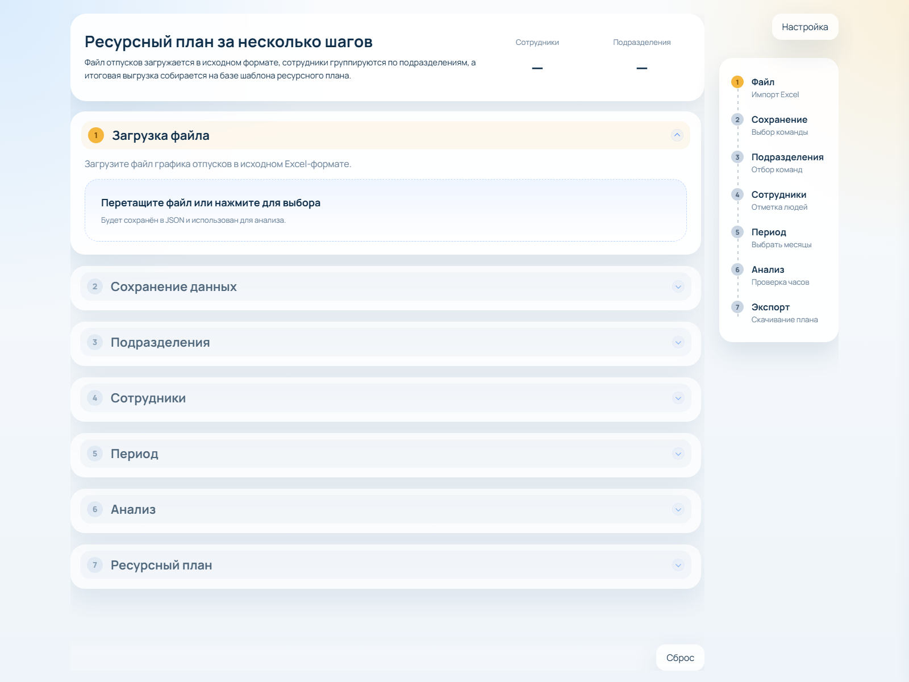
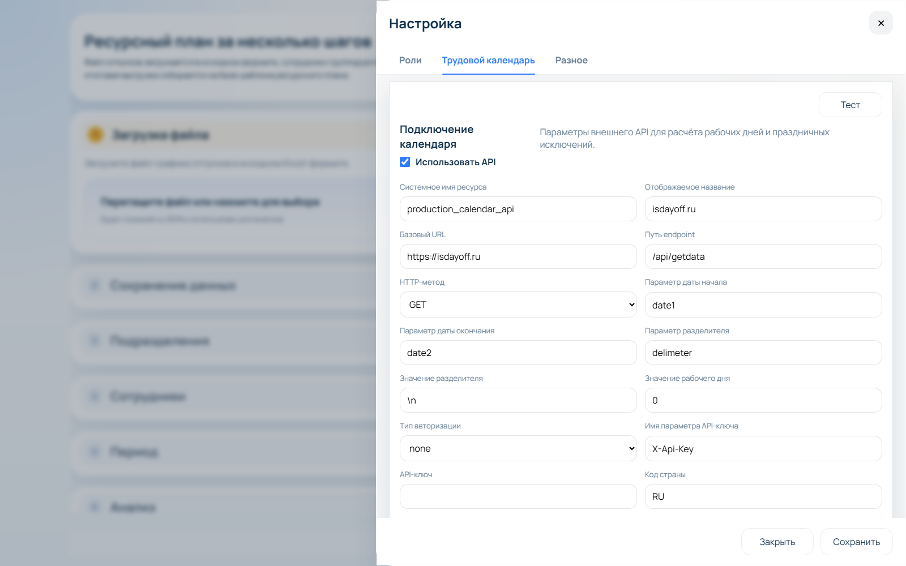

# Техническое задание (по текущему коду, структурированная редакция)
## Проект: ResourcePlanSymphony

## 1. Назначение документа
Документ описывает систему ресурсного планирования на основе фактической реализации и задает требования для разработки, сопровождения и приемки.

Цель документа:
- зафиксировать, что делает система и как она работает;
- описать формы, поля, кнопки и их поведение;
- описать связь UI с хранением данных;
- дать технические контракты (данные, API, алгоритмы) в конце документа.

## 2. Что это за система
`ResourcePlanSymphony` — система расчета ресурсной доступности команд с учетом отпусков сотрудников.

Система:
1. принимает файл графика отпусков (`.xlsx`);
2. формирует набор сотрудников, подразделений и периодов отпусков;
3. применяет настройки ролей, команд и распределения времени;
4. рассчитывает доступность по спринтам/месяцам;
5. формирует Excel-отчет по шаблону.

## 3. Как работает система (кратко и по делу)
1. Пользователь загружает файл отпусков.
2. Выбирает команду, подразделения, сотрудников, месяцы.
3. Запускает анализ.
4. Получает расчет на экране.
5. Скачивает итоговый Excel-файл.

Ключевая особенность:
- рабочие дни считаются через внешний календарный API, а при ошибке используется fallback (будни/выходные).

## 4. Стек продукта
| Слой | Технологии | Назначение |
|---|---|---|
| Backend | `Node.js`, `Express`, `multer`, `ExcelJS` | API, загрузка файла, расчет, экспорт |
| Frontend | `HTML`, `CSS`, `Vanilla JS` | Мастер из 7 шагов, слайдер настроек |
| Хранение состояния | JSON-файлы в `data/` | `settings` и `vacations` |
| Экспорт | Excel-шаблон `Ресурсный план.xlsx` | Сводный и детальный план |
| Запуск | `start.bat` / `stop.bat`, порт `3003` | Локальная эксплуатация |

## 5. Описание страниц и форм
Ниже каждая страница описана в единой структуре:
- Заголовок
- Скриншот
- Назначение формы
- Описание активных элементов формы
- Логика работы
- Описание полей
- Связь с БД
- Тип данных элементов формы, обязательные и необязательные поля

### 5.1 Страница: Главная (мастер 1..7)
#### Заголовок
`Ресурсный план за несколько шагов`

#### Скриншот


#### Назначение формы
Основная рабочая форма пользователя:
- импорт отпусков;
- выбор периметра расчета;
- запуск анализа;
- экспорт файла.

#### Описание активных элементов формы
| Элемент | Тип | Действие | Результат |
|---|---|---|---|
| `fileInput` | file input | Загрузка `.xlsx` | Импорт отпусков |
| `workflow-team` | radio list | Выбор команды | Применение состава команды |
| `departmentList` | checkbox list | Выбор департаментов | Фильтр сотрудников |
| `employeeGroups` | checkbox list | Выбор сотрудников | `employeeIds` для анализа |
| `yearList` | buttons/chips | Выбор года | Перерисовка месяцев |
| `monthList` | checkbox tiles | Выбор месяцев | Непрерывный диапазон месяцев |
| `analyzeBtn` | button | Анализ | Расчет и вывод аналитики |
| `exportBtn` | button | Экспорт | Скачивание `.xlsx` |
| `resetBtn` | button | Сброс | Очистка workflow |
| `openSettingsBtn` | button | Настройка | Открытие слайдера |

#### Логика работы
1. При открытии выполняется bootstrap состояния.
2. После загрузки файла обновляются данные сотрудников и подразделений.
3. При любом изменении selection текущий анализ сбрасывается.
4. Перед переходом к периоду состав команды сохраняется.
5. Анализ и экспорт используют единый payload выбора.

#### Описание полей
| Поле | Описание | Тип данных | Обязательность | Правила |
|---|---|---|---|---|
| `file` | Файл отпусков | `File (.xlsx)` | Обязательное | Должен быть передан |
| `teamKey` | Выбранная команда | `string` | Обязательное для анализа/экспорта | Команда должна существовать |
| `departments[]` | Подразделения | `string[]` | Обязательное | Минимум 1 |
| `employeeIds[]` | Сотрудники | `string[]` | Обязательное | Минимум 1 |
| `months[]` | Период | `string[] (YYYY-MM)` | Обязательное | Только подряд, максимум 3 для шаблона |

#### Связь с БД
| UI-данные | Текущее хранение (as-is) | Логическая БД-модель |
|---|---|---|
| Загруженные отпуска | `data/vacations.json` | `app_vacations_import`, `app_employees`, `app_vacation_periods` |
| Назначения ролей | `settings.userAssignments` | `app_user_assignments` |
| Выбор на форме | Клиентский `state` | В БД постоянно не хранится |

#### Тип данных элементов формы, обязательные и необязательные поля
| Группа | Тип элементов | Обязательные поля | Необязательные поля |
|---|---|---|---|
| Импорт | file input | `file` | - |
| Периметр | radio + checkbox | `teamKey`, `departments[]`, `employeeIds[]`, `months[]` | - |
| Управление | buttons | `analyzeBtn`, `exportBtn` (сценарно) | `resetBtn`, `openSettingsBtn` |

### 5.2 Страница: Настройки -> Роли
#### Заголовок
`Настройка` -> вкладка `Роли`

#### Скриншот


#### Назначение формы
Управление организационной моделью планирования:
- команды;
- группы ролей;
- роли и категории работ;
- распределение времени;
- состав команды и участие сотрудников.

#### Описание активных элементов формы
| Элемент | Тип | Действие | Результат |
|---|---|---|---|
| `addTeamBtn` | button | Добавить команду | Новая команда в draft |
| `copyTopTeamBtn` | button | Копировать команду | Клон с группами/ролями |
| Team tabs drag&drop | drag/drop | Изменить порядок | Перестановка команд |
| `team-name` | text | Изменить название | Обновление draft |
| `distribution.*` | numeric text | Изменить проценты | Пересчет total |
| `add-role-to-team` | button | Добавить роль | Новая роль в команде |
| `role-name` | text | Изменить роль | Обновление role |
| `role-category-*` | text/number/textarea | Редактировать категорию | Обновление часов/описания |
| `team-member-role` | textarea | Изменить роль участника | Обновление состава |
| `team-member-participation` | numeric text | Изменить участие | Значение 0..100 |
| `saveSettingsBtn` | button | Сохранить | `PUT /api/settings` |

#### Логика работы
1. Изменения вносятся в `settingsDraft`.
2. При сохранении выполняется проверка обязательных полей.
3. Проверяется правило распределения `total = 100%`.
4. При успехе состояние сохраняется на backend.

#### Описание полей
| Поле | Описание | Тип данных | Обязательность | Правила |
|---|---|---|---|---|
| `team.name` | Название команды | `string` | Обязательное | Непустое |
| `distribution.keyTasks` | Ключевые задачи | `number` | Обязательное | 0..100 |
| `distribution.support` | Поддержка | `number` | Обязательное | 0..100 |
| `distribution.architecture` | Архитектура | `number` | Обязательное | 0..100 |
| `distribution.other` | Прочие задачи | `number` | Обязательное | 0..100 |
| `distribution.total` | Итог распределения | `calculated number` | Обязательное | Должно быть 100 |
| `role.name` | Название роли | `string` | Обязательное | Непустое |
| `category.label` | Вид работ | `string` | Обязательное | Непустое |
| `category.hours` | Часы категории | `number` | Обязательное | >= 0 |
| `category.description` | Описание работ | `string` | Обязательное | Непустое |
| `member.role` | Текстовая роль участника | `string` | Необязательное | Свободный ввод |
| `member.participationPercent` | Участие сотрудника | `integer` | Обязательное | 0..100 |

#### Связь с БД
| UI-данные | Текущее хранение (as-is) | Логическая БД-модель |
|---|---|---|
| Команды | `settings.teams` | `app_teams` |
| Группы ролей | `settings.roleGroups` | `app_role_groups` |
| Роли | `settings.roles` | `app_roles` |
| Категории | `settings.roles[].categories` | `app_role_categories` |
| Состав команды | `settings.teams[].members` | `app_team_members` |

#### Тип данных элементов формы, обязательные и необязательные поля
| Группа | Тип элементов | Обязательные поля | Необязательные поля |
|---|---|---|---|
| Команда | text | `team.name` | - |
| Распределение | numeric text | `keyTasks`, `support`, `architecture`, `other`, `total` | - |
| Роли/категории | text/number/textarea | `role.name`, `category.label`, `category.hours`, `category.description` | - |
| Состав | textarea + numeric | `participationPercent` | `member.role` |

### 5.3 Страница: Настройки -> Трудовой календарь
#### Заголовок
`Настройка` -> вкладка `Трудовой календарь`

#### Скриншот


#### Назначение формы
Конфигурация источника рабочих дней для расчета доступности.

#### Описание активных элементов формы
| Элемент | Тип | Действие | Результат |
|---|---|---|---|
| `enabled` | checkbox | Вкл/выкл API | Переключение режима расчета |
| Параметры API | text/select/password/number | Настройка интеграции | Обновление `calendarApi` |
| `testSettingsBtn` | button | Проверка полей | Локальная валидация |
| `saveSettingsBtn` | button | Сохранение | `PUT /api/settings` |

#### Логика работы
1. При `enabled=true` используется внешний API.
2. При ошибке API автоматически применяется fallback.
3. Настройки вступают в силу после сохранения.

#### Описание полей
| Поле | Описание | Тип данных | Обязательность | Правила |
|---|---|---|---|---|
| `enabled` | Флаг интеграции | `boolean` | Необязательное | true/false |
| `resourceName` | Системное имя | `string` | Обязательное при `enabled=true` | Непустое |
| `displayName` | Название для UI | `string` | Обязательное при `enabled=true` | Непустое |
| `baseUrl` | Базовый URL | `string` | Обязательное при `enabled=true` | URL |
| `endpointPath` | Путь endpoint | `string` | Обязательное при `enabled=true` | Непустое |
| `method` | HTTP метод | `enum` | Обязательное при `enabled=true` | `GET/POST` |
| `queryFromParam` | Парам. даты начала | `string` | Обязательное при `enabled=true` | Непустое |
| `queryToParam` | Парам. даты окончания | `string` | Обязательное при `enabled=true` | Непустое |
| `queryDelimiterParam` | Парам. разделителя | `string` | Обязательное при `enabled=true` | Непустое |
| `queryDelimiterValue` | Значение разделителя | `string` | Обязательное при `enabled=true` | Непустое |
| `successWorkdayValue` | Код рабочего дня | `string` | Обязательное при `enabled=true` | Непустое |
| `authType` | Тип авторизации | `enum` | Обязательное при `enabled=true` | `none/header/query` |
| `apiKeyParamName` | Имя параметра/заголовка | `string` | Обязательное при `authType != none` | Непустое |
| `apiKey` | API ключ | `string` | Обязательное при `authType != none` | Непустое |
| `country` | Код страны | `string` | Необязательное | Напр. `RU` |
| `timeoutMs` | Таймаут | `integer` | Обязательное при `enabled=true` | > 0 |
| `fallbackMode` | Режим fallback | `enum` | Обязательное при `enabled=true` | `weekends` |
| `notes` | Комментарий | `string` | Необязательное | Свободный текст |

#### Связь с БД
| UI-данные | Текущее хранение (as-is) | Логическая БД-модель |
|---|---|---|
| Блок календаря | `settings.calendarApi` | `app_settings.calendar_api` |

#### Тип данных элементов формы, обязательные и необязательные поля
| Группа | Тип элементов | Обязательные поля | Необязательные поля |
|---|---|---|---|
| Включение API | checkbox | - | `enabled` |
| Подключение API | text/select/number/password | required-поля при `enabled=true` | `country`, `notes` |
| Авторизация | select + text + password | `authType`, `apiKeyParamName`, `apiKey` (условно) | - |

### 5.4 Страница: Настройки -> Разное
#### Заголовок
`Настройка` -> вкладка `Разное`

#### Скриншот


#### Назначение формы
Настройка параметров представления результата анализа.

#### Описание активных элементов формы
| Элемент | Тип | Действие | Результат |
|---|---|---|---|
| `reportGroupingMode` | radio | Выбор режима | Группировка результата |
| `saveSettingsBtn` | button | Сохранить | `PUT /api/settings` |

#### Логика работы
1. Пользователь выбирает режим отчета.
2. Режим сохраняется в `settings.misc`.
3. Анализ использует режим:
   - `grouped` — вывод по группам ролей;
   - `ungrouped` — вывод по отдельным ролям/должностям.

#### Описание полей
| Поле | Описание | Тип данных | Обязательность | Правила |
|---|---|---|---|---|
| `misc.reportGroupingMode` | Режим отчета | `enum` | Обязательное | `grouped/ungrouped` |
| `misc.sprintDurationDays` | Длина спринта (модель) | `integer` | Обязательное (в модели) | `1..9` |
| `misc.sprintStartDay` | День старта спринта (модель) | `enum` | Обязательное (в модели) | `sunday..saturday` |

#### Связь с БД
| UI-данные | Текущее хранение (as-is) | Логическая БД-модель |
|---|---|---|
| Блок `misc` | `settings.misc` | `app_settings.misc` |

#### Тип данных элементов формы, обязательные и необязательные поля
| Группа | Тип элементов | Обязательные поля | Необязательные поля |
|---|---|---|---|
| Режим отчета | radio | `reportGroupingMode` | - |
| Параметры спринта (модель) | enum/integer | `sprintStartDay`, `sprintDurationDays` | - |

## 6. Функциональные требования (без технических деталей)
1. Импорт и корректный разбор отпусков из Excel.
2. Настройка команд/ролей/календаря через UI.
3. Расчет доступности сотрудников по выбранному периоду.
4. Выгрузка Excel-файла ресурсного плана.
5. Корректная обработка ошибок с понятным сообщением пользователю.

## 7. Нефункциональные требования
| Категория | Требование |
|---|---|
| Производительность | `bootstrap` до 1.5 сек, `analyze` до 4 сек, `export` до 8 сек (целевые значения) |
| Надежность | При проблемах календарного API расчет не падает, включается fallback |
| Эксплуатация | Запуск/остановка через `start.bat`/`stop.bat` на порту `3003` |
| UX | UI не должен «ломаться» при серверной ошибке, должен показывать текст ошибки |

## 8. Критерии приемки
1. Главная страница открывается на `http://127.0.0.1:3003`.
2. Пользователь проходит шаги 1..7 без критических ошибок.
3. Анализ выдает согласованный результат по ролям/сотрудникам/неделям.
4. Экспортированный `.xlsx` открывается в Excel без восстановления.
5. Настройки сохраняются и применяются повторно.

## 9. Ограничения и обязательные доработки до production
1. Добавить аутентификацию/авторизацию.
2. Добавить аудит изменений настроек.
3. Перевести хранение состояния в транзакционную БД.
4. Добавить версионирование API (`/api/v1`).
5. Ввести CI/CD и contract-тесты API/экспорта.

## 10. Артефакты
- Основной документ: `ResourcePlanSymphony_Technical_Assignment_ByCode.md`
- Версия DOCX: `ResourcePlanSymphony_Technical_Assignment_ByCode.docx`
- Скриншоты: `docs/product-screenshots/*.png`

---

## 11. Техническое описание (внизу документа)

### 11.1 Контракты данных
#### 11.1.1 Settings
```json
{
  "updatedAt": "ISO-8601",
  "calendarApi": {
    "enabled": true,
    "resourceName": "production_calendar_api",
    "displayName": "isdayoff.ru",
    "baseUrl": "https://isdayoff.ru",
    "endpointPath": "/api/getdata",
    "method": "GET",
    "queryFromParam": "date1",
    "queryToParam": "date2",
    "queryDelimiterParam": "delimeter",
    "queryDelimiterValue": "\\n",
    "successWorkdayValue": "0",
    "authType": "none",
    "apiKey": "",
    "apiKeyParamName": "X-Api-Key",
    "country": "RU",
    "timeoutMs": 10000,
    "fallbackMode": "weekends",
    "notes": ""
  },
  "misc": {
    "reportGroupingMode": "grouped",
    "sprintDurationDays": 7,
    "sprintStartDay": "monday"
  },
  "distribution": {
    "total": 1,
    "business": 0.7,
    "keyTasks": 0.5,
    "support": 0.2,
    "internal": 0.3,
    "architecture": 0.2,
    "other": 0.1
  },
  "roles": [],
  "roleGroups": [],
  "teams": [],
  "userAssignments": {}
}
```

#### 11.1.2 Vacations
```json
{
  "sourceFileName": "string",
  "importedAt": "ISO-8601",
  "departments": ["string"],
  "monthOptions": [{"key": "YYYY-MM", "year": 2026, "month": 4}],
  "employees": [
    {
      "id": "department::fullname-normalized",
      "department": "string",
      "fullName": "string",
      "position": "string",
      "totalVacationDays": 0,
      "vacations": [
        {"start": "YYYY-MM-DD", "end": "YYYY-MM-DD", "days": 0}
      ]
    }
  ]
}
```

#### 11.1.3 Analyze request
```json
{
  "teamKey": "string",
  "departments": ["string"],
  "employeeIds": ["string"],
  "months": ["YYYY-MM"]
}
```

### 11.2 API-контракты
| Endpoint | Метод | Назначение | Успех | Ошибки |
|---|---|---|---|---|
| `/api/bootstrap` | `GET` | Получить текущее состояние | `{settings, vacations}` | `500` |
| `/api/upload-vacations` | `POST` | Импорт файла отпусков | `{vacations, settings}` | `400` если файл отсутствует |
| `/api/settings` | `PUT` | Сохранить настройки | `settings` | `400`, `500` |
| `/api/reset-workflow` | `POST` | Сбросить текущий workflow | `{settings, vacations}` | `500` |
| `/api/calendar/month-workdays` | `GET` | Получить рабочие дни по месяцам | `{year, months[]}` | `400` при невалидном годе |
| `/api/analyze` | `POST` | Выполнить расчет | `plan + settings` | `400` бизнес-ошибки |
| `/api/team-members/save` | `POST` | Сохранить состав команды | `{settings, team}` | `400/404` |
| `/api/team-members/clear` | `POST` | Очистить состав команды | `{settings, team}` | `400/404` |
| `/api/team-members/refresh` | `POST` | Обновить состав команды | `{settings, team}` | `400/404` |
| `/api/export` | `POST` | Экспорт `.xlsx` | file attachment | `400` |

### 11.3 Алгоритмы расчета
#### 11.3.1 Выбор роли сотрудника
Порядок определения:
1. Точное совпадение должности с именем роли.
2. Токен-матч (`разработ`, `тест`, `аналит`).
3. Fallback на `settings.userAssignments`.

#### 11.3.2 Период и спринты
- Месяцы должны быть выбраны подряд.
- Для шаблонного экспорта допускается максимум 3 месяца.
- Длина спринта задается `misc.sprintDurationDays`, старт `misc.sprintStartDay`.

#### 11.3.3 Формула доступных часов
Для сотрудника на спринте:

`value = round((role.primaryHours * availableDays / baselineWorkingDays) * participationFactor)`

где:
- `availableDays = workingDays - vacationWorkdays`
- `participationFactor = participationPercent / 100`

### 11.4 Валидации
1. Выбран минимум 1 месяц, 1 сотрудник, 1 подразделение, 1 команда.
2. Месяцы подряд, без пропусков.
3. У сотрудника должна определиться роль (иначе ошибка).
4. В настройках обязательные поля не пустые.
5. Распределение времени команды должно давать `100%`.

### 11.5 Хранение состояния (as-is)
| Файл | Назначение |
|---|---|
| `data/settings.json` | Настройки системы |
| `data/vacations.json` | Импортированные отпуска |

### 11.6 Логическая структура таблиц (target-модель)
#### 11.6.1 `app_settings`
| Поле | Тип | PK | FK | Nullable | Описание |
|---|---|---|---|---|---|
| `id` | uuid | Да | - | Нет | Идентификатор набора настроек |
| `updated_at` | timestamp | Нет | - | Нет | Дата обновления |
| `calendar_api` | jsonb | Нет | - | Нет | Параметры календаря |
| `misc` | jsonb | Нет | - | Нет | Доп. параметры |
| `distribution` | jsonb | Нет | - | Нет | Базовое распределение |

#### 11.6.2 `app_roles`
| Поле | Тип | PK | FK | Nullable | Описание |
|---|---|---|---|---|---|
| `role_key` | varchar | Да | - | Нет | Ключ роли |
| `settings_id` | uuid | Нет | `app_settings.id` | Нет | Владелец |
| `name` | varchar | Нет | - | Нет | Название |
| `summary_label` | varchar | Нет | - | Нет | Подпись сводки |
| `detail_total_label` | varchar | Нет | - | Нет | Подпись детального итога |
| `sprint_hours` | numeric | Нет | - | Нет | Часы роли |

#### 11.6.3 `app_role_categories`
| Поле | Тип | PK | FK | Nullable | Описание |
|---|---|---|---|---|---|
| `category_key` | varchar | Да | - | Нет | Ключ категории |
| `role_key` | varchar | Нет | `app_roles.role_key` | Нет | Роль |
| `label` | varchar | Нет | - | Нет | Название |
| `hours` | numeric | Нет | - | Нет | Часы |
| `description` | text | Нет | - | Нет | Описание |
| `is_primary` | boolean | Нет | - | Нет | Основная категория |

#### 11.6.4 `app_role_groups`
| Поле | Тип | PK | FK | Nullable | Описание |
|---|---|---|---|---|---|
| `group_key` | varchar | Да | - | Нет | Ключ группы |
| `settings_id` | uuid | Нет | `app_settings.id` | Нет | Владелец |
| `name` | varchar | Нет | - | Нет | Название |
| `summary_label` | varchar | Нет | - | Нет | Подпись сводки |
| `detail_total_label` | varchar | Нет | - | Нет | Подпись детального итога |

#### 11.6.5 `app_teams`
| Поле | Тип | PK | FK | Nullable | Описание |
|---|---|---|---|---|---|
| `team_key` | varchar | Да | - | Нет | Ключ команды |
| `settings_id` | uuid | Нет | `app_settings.id` | Нет | Владелец |
| `name` | varchar | Нет | - | Нет | Название |
| `distribution` | jsonb | Нет | - | Нет | Распределение команды |
| `sort_order` | int | Нет | - | Нет | Порядок |

#### 11.6.6 `app_team_members`
| Поле | Тип | PK | FK | Nullable | Описание |
|---|---|---|---|---|---|
| `id` | uuid | Да | - | Нет | Идентификатор |
| `team_key` | varchar | Нет | `app_teams.team_key` | Нет | Команда |
| `department` | varchar | Нет | - | Нет | Подразделение |
| `position` | varchar | Нет | - | Нет | Должность |
| `role` | varchar | Нет | - | Да | Роль (текст) |
| `full_name` | varchar | Нет | - | Нет | ФИО |
| `participation_percent` | int | Нет | - | Нет | Участие 0..100 |

#### 11.6.7 `app_vacations_import`
| Поле | Тип | PK | FK | Nullable | Описание |
|---|---|---|---|---|---|
| `id` | uuid | Да | - | Нет | Импорт |
| `source_file_name` | varchar | Нет | - | Нет | Имя файла |
| `imported_at` | timestamp | Нет | - | Нет | Дата импорта |

#### 11.6.8 `app_employees`
| Поле | Тип | PK | FK | Nullable | Описание |
|---|---|---|---|---|---|
| `employee_id` | varchar | Да | - | Нет | ID сотрудника |
| `vacations_import_id` | uuid | Нет | `app_vacations_import.id` | Нет | Связь с импортом |
| `department` | varchar | Нет | - | Нет | Подразделение |
| `full_name` | varchar | Нет | - | Нет | ФИО |
| `position` | varchar | Нет | - | Да | Должность |
| `total_vacation_days` | int | Нет | - | Да | Итого отпускных дней |

#### 11.6.9 `app_vacation_periods`
| Поле | Тип | PK | FK | Nullable | Описание |
|---|---|---|---|---|---|
| `id` | uuid | Да | - | Нет | Запись периода |
| `employee_id` | varchar | Нет | `app_employees.employee_id` | Нет | Сотрудник |
| `date_start` | date | Нет | - | Нет | Начало |
| `date_end` | date | Нет | - | Нет | Окончание |
| `days` | int | Нет | - | Нет | Количество дней |
